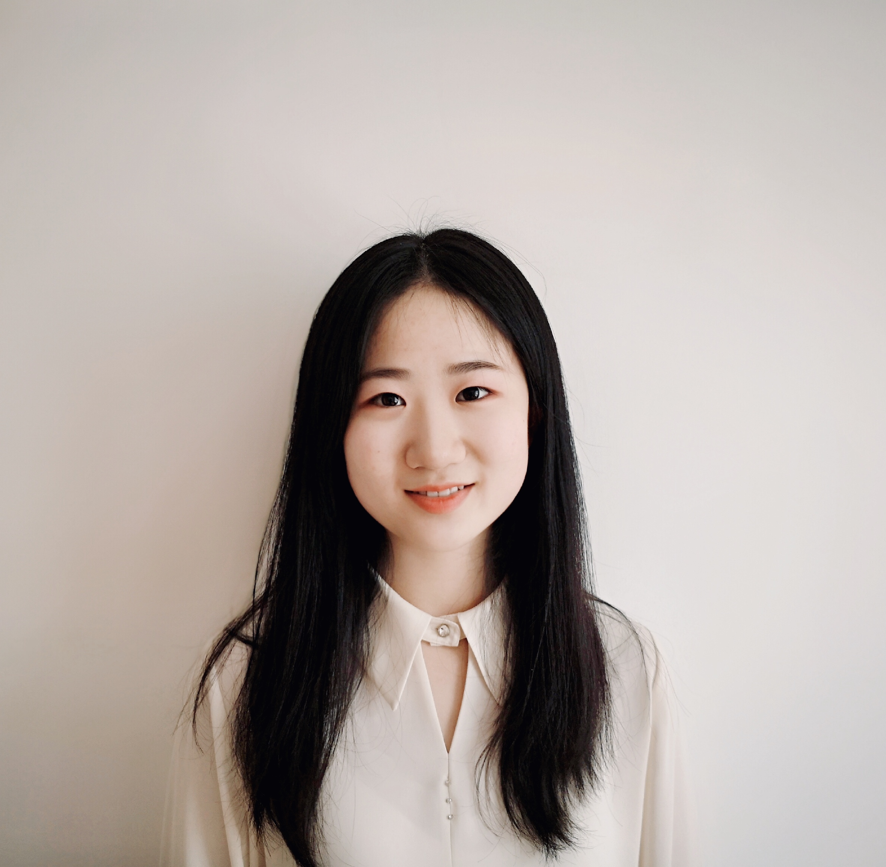

## About Me

I am a final-year undergraduate student at [Tsinghua University](https://www.tsinghua.edu.cn/en/index.htm). I'm fortunate to collaborate with [Prof. Mengdi Wang](https://mwang.princeton.edu/) at Princeton University as a research intern. In Spring 2021, I was lucky to work with [Prof. Cyrus Shahabi](https://viterbi.usc.edu/directory/faculty/Shahabi/Cyrus). In Fall 2020, I was a research assistant in Tsinghua Universal Machine Learning (THUML) Group under the supervision of [Prof. Mingsheng Long](http://ise.thss.tsinghua.edu.cn/~mlong/).

## Research Interests

- **Computer Vision:** image recognition, image generation, video captioning
- **Machine Learning:** meta-learning, incremental learning, transfer learning

## News

- **[Feb. 2020]** Our paper about incremental learning is accepted to CVPR 2020.
- **[Feb. 2020]** We will host the ACM Multimedia Asia 2020 conference in Singapore!
- **[Sept. 2019]** Our paper about few-shot learning is accepted to NeurIPS 2019.
- **[Mar. 2019]** Our paper about few-shot learning is accepted to CVPR 2019.

## Publications

            

                
            

            

                <h3>Stanza: A Python Natural Language Processing Toolkit for Many Human Languages. <a href="https://arxiv.org/pdf/2003.07082.pdf" style="color:rgba(0,0,255,0.5);font-size:10pt">[PDF]</a><a href="https://stanfordnlp.github.io/stanza/" style="color:rgba(0,0,255,0.5);font-size:10pt">[DOC]</a><a href="http://stanza.run" style="color:rgba(0,0,255,0.5);font-size:10pt">[DEMO]</a></h3>
                <h4>Peng Qi*, Yuhao Zhang*, <b style="color:rgba(255,0,0,0.5)">Yuhui Zhang</b>, Jason Bolton, Christopher D. Manning.</h4>
                <h4><i>ACL: System Demonstrations (2020)</i>.</h4>
                
The Stanford NLP Group's official Python NLP library. It contains support for running various accurate natural language processing tools on 60+ languages and for accessing the Java Stanford CoreNLP software from Python. 

            

- **Mnemonics Training: Multi-Class Incremental Learning without Forgetting**
   
  **Yaoyao Liu**, Yuting Su, An-An Liu, Bernt Schiele, Qianru Sun
   
  IEEE Conference on Computer Vision and Pattern Recognition. **CVPR 2020**.
   
  [[PDF](https://arxiv.org/pdf/2002.10211.pdf)] [[Code](https://github.com/yaoyao-liu/mnemonics)] <strong><i style="color:#e74d3c">Oral Presentation</i></strong>

- **Learning to Self-Train for Semi-Supervised Few-Shot Classification**
   
  Xinzhe Li, Qianru Sun, **Yaoyao Liu**, Shibao Zheng, Qin Zhou, Tat-Seng Chua, Bernt Schiele
   
  33rd Conference on Neural Information Processing Systems. **NeurIPS 2019**.
   
  [[PDF](http://papers.nips.cc/paper/9216-learning-to-self-train-for-semi-supervised-few-shot-classification.pdf)] [[Code](https://github.com/xinzheli1217/learning-to-self-train)]

- **Meta-Transfer Learning for Few-Shot Learning**
   
  Qianru Sun\*, **Yaoyao Liu\***, Tat-Seng Chua, Bernt Schiele
   
  IEEE Conference on Computer Vision and Pattern Recognition. **CVPR 2019**.
   
  [[PDF](http://openaccess.thecvf.com/content_CVPR_2019/papers/Sun_Meta-Transfer_Learning_for_Few-Shot_Learning_CVPR_2019_paper.pdf)] [[Code](https://github.com/yaoyao-liu/meta-transfer-learning)] [[Project](https://mtl.yyliu.net/)]

## Services

- Conference Reviewers: NeurIPS 2020, CVPR 2020.
- Journal Reviewers: T-PAMI, IJCV.
