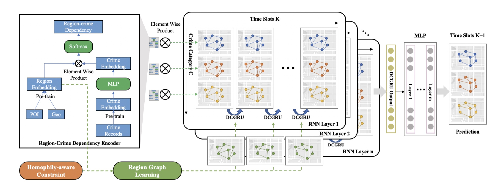
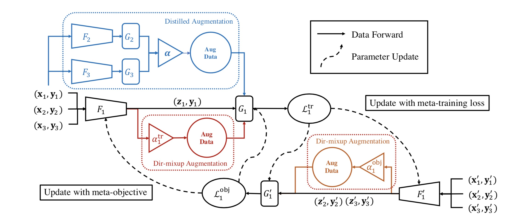
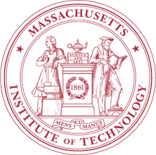
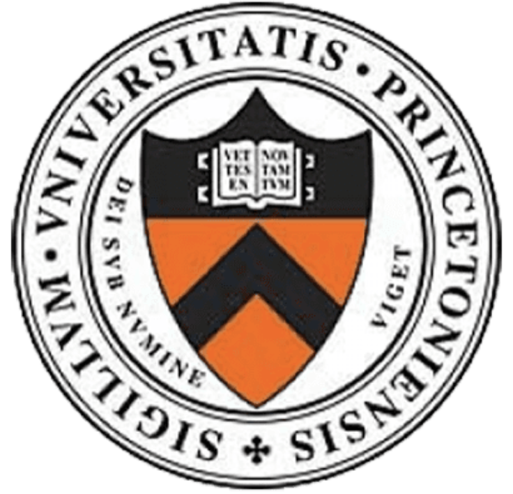
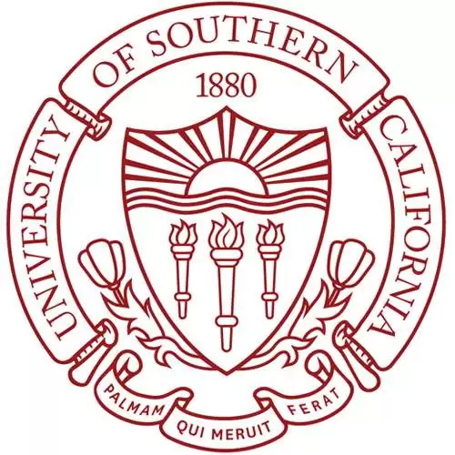

<h2>
About Me
</h2>

I am a second-year PhD student at [MIT EECS](https://www.eecs.mit.edu/), advised by [Tommi Jaakkola](https://people.csail.mit.edu/tommi/) and [Caroline Uhler](https://www.carolineuhler.com/). I am also affiliated with Eric and Wendy Schmidt Center ([EWSC](https://www.ericandwendyschmidtcenter.org/)) at [Broad Institute](https://www.broadinstitute.org/). My research interests lie broadly in machine learning, representation learning, and AI for science. Recently my research focuses on multi-modal representation learning and perturbation modelling for drug discovery. I am also interested in foundation models for science and spatial-temporal modelling in system biology.

Before my PhD, I obtained my Bachelor’s degree from [Tsinghua University](https://www.tsinghua.edu.cn/en/index.htm), working as a research assistant in Tsinghua Universal Machine Learning (THUML) Group under the supervision of [Mingsheng Long](http://ise.thss.tsinghua.edu.cn/~mlong/). I was also fortunate to work as a research intern with [Mengdi Wang](https://mwang.princeton.edu/) at Princeton University and with [Cyrus Shahabi](https://viterbi.usc.edu/directory/faculty/Shahabi/Cyrus) at University of Southern California.

<!-- Feel free to contact me at wangchy [at] mit [dot] edu. -->

[Google Scholar](https://scholar.google.com/citations?user=Kq0dhLAAAAAJ&hl) / [LinkedIn](https://www.linkedin.com/in/chenyu-wang-3a6a9a193/) / [Twitter](https://twitter.com/ChenyuW64562111)

[Resume](resume_ChenyuWang_Jan2024.pdf) (Updated in Jan 2024)
<!-- [Resume](resume_ChenyuWang.pdf) (Updated in Nov 2023) -->
 
 

<h2>
Publications & Preprints
</h2>

<table frame=void rules=none>
    <tr>
        <td width="33%">
            <!--左侧内容-->
             
            
        </td>
        <td>
            <!--右侧内容-->
             
            <b> Removing Biases from Molecular Representations via Information Maximization </b>
             
            <b>Chenyu Wang</b>, <a href="https://www.mit.edu/~sharut/">Sharut Gupta</a>, <a href="https://www.carolineuhler.com/">Caroline Uhler</a>, <a href="https://people.csail.mit.edu/tommi/">Tommi Jaakkola</a>
             
            International Conference on Learning Representations. <b>ICLR 2024</b>.
            <!--  
            NeurIPS: New Frontiers of AI for Drug Discovery and Development. <b>NeurIPS 2023 AI4D3 Workshop</b>. -->
             
            <a href="https://arxiv.org/abs/2312.00718"> [Paper] </a> <a href="https://github.com/uhlerlab/InfoCORE"> [Code] </a>
        </td>
    </tr>
</table>

We propose InfoCORE to mitigate the confounding factors in multimodal molecular representation learning from multiple information sources, in particular the confounding batch effects in drug screening data.
 
 

<table frame=void rules=none>
    <tr>
        <td width="33%">
            <!--左侧内容-->
             
            
        </td>
        <td>
            <!--右侧内容-->
             
            <b> Tree-Based Neural Bandits for High-Value Protein Design </b>
             
            <b>Chenyu Wang</b>*, Joseph Kim*, <a href="https://profiles.stanford.edu/186687">Le Cong</a>, <a href="https://mwang.princeton.edu/">Mengdi Wang</a> (* Equal Contribution)
             
            56th Annual Conference on Information Sciences and Systems. <b>CISS 2022</b>.
             
            <a href="protein_design.pdf"> [Paper] </a>
        </td>
    </tr>
</table>

We propose an MCTS-guided neural contextual bandits algorithm that utilizes a modified upper-confidence bound algorithm for accelerating the search for optimal protein designs.
 
 

<table frame=void rules=none>
<!-- <table style="margin-left: auto; margin-right: auto;" frame=void rules=none> -->
    <tr>
        <td width="33%">
            <!--左侧内容-->
             
            
        </td>
        <td>
            <!--右侧内容-->
             
            <b> HAGEN: Homophily-Aware Graph Convolutional Recurrent Network for Crime Forecasting </b>
             
            <b>Chenyu Wang</b>*, <a href="https://rafa-zy.github.io/">Zongyu Lin</a>*, Xiaochen Yang, <a href="http://www-scf.usc.edu/~mingxuay/">Mingxuan Yue</a>, <a href="https://caozhangjie.github.io/">Jiao Sun</a>, <a href="https://viterbi.usc.edu/directory/faculty/Shahabi/Cyrus">Cyrus Shahabi</a> (* Equal Contribution)
             
            AAAI Conference on Artificial Intelligence. <b>AAAI 2022</b>. <b>(Oral Presentation)</b>
             
            <a href="https://ojs.aaai.org/index.php/AAAI/article/view/20338"> [Paper] </a> <a href="https://github.com/Rafa-zy/HAGEN"> [Code] </a> <a href="https://www.youtube.com/watch?v=IyBV33tEx0E"> [Talk at TGL] </a>
        </td>
    </tr>
</table>

We present HAGEN, an end-to-end graph convolutional recurrent network with a novel homophily-aware graph learning module to learn spatiotemporal dynamics for crime forecasting.
 
 

<!-- <table style="margin-left: auto; margin-right: auto;" frame=void rules=none> -->
<table frame=void rules=none>
    <tr>
        <td width="33%">
             
            
        </td>
        <td>
             
            <b> Open Domain Generalization with Domain-Augmented Meta-Learning </b>
             
            <a href="https://shuyang96.github.io/">Yang Shu</a>*, <a href="https://caozhangjie.github.io/">Zhangjie Cao</a>*, <b>Chenyu Wang</b>, <a href="https://www.thss.tsinghua.edu.cn/publish/soften/3131/2010/20101219100058471372347/20101219100058471372347_.html">Jianmin Wang</a>, <a href="http://ise.thss.tsinghua.edu.cn/~mlong/">Mingsheng Long</a> (* Equal Contribution)
             
            IEEE Conference on Computer Vision and Pattern Recognition. <b>CVPR 2021</b>.
             
            <a href="https://openaccess.thecvf.com/content/CVPR2021/papers/Shu_Open_Domain_Generalization_with_Domain-Augmented_Meta-Learning_CVPR_2021_paper.pdf"> [Paper] </a> <a href="https://github.com/thuml/OpenDG-DAML"> [Code] </a>
        </td>
    </tr>
</table>
We propose a novel Domain-Augmented Meta-Learning framework (DAML) to address the new open domain generalization problem, which conducts meta-learning over domains augmented at both feature-level and label-level.
 
 

<h2>
Education
</h2>
<table frame=void rules=none>
    <tr>
        <td width="15%">
             
            
        </td>
        <td>
             
            <b> Massachusetts Institute of Technology</b>
             
            2022.08-Present
             
            PhD student in Computer Science
             
            Advisor: <a href="https://people.csail.mit.edu/tommi/">Tommi Jaakkola</a>, <a href="https://www.carolineuhler.com/">Caroline Uhler</a>            
        </td>
    </tr>
</table>

<table frame=void rules=none>
    <tr>
        <td width="15%">
             
            
        </td>
        <td>
             
            <b> Tsinghua University</b>
             
            2018.08-2022.06
             
            B.S. in Economics
             
            Minor in Data Science and Technology
             
            Advisor: <a href="http://ise.thss.tsinghua.edu.cn/~mlong/">Mingsheng Long</a>  
             
            Mentor: <a href="https://shuyang96.github.io/">Yang Shu</a>       
        </td>
    </tr>
</table>

<table frame=void rules=none>
    <tr>
        <td width="15%">
             
            
        </td>
        <td>
             
            <b> Princeton University</b>
             
            2021.06-2021.12
             
            Research intern
             
            Advisor: <a href="https://mwang.princeton.edu/">Mengdi Wang</a>, <a href="https://profiles.stanford.edu/186687">Le Cong</a>  
             
            Mentor: Joseph Kim, <a href="https://huazhengwang.github.io/">Huazheng Wang</a>       
        </td>
    </tr>
</table>

<table frame=void rules=none>
    <tr>
        <td width="15%">
             
            
        </td>
        <td>
             
            <b> University of Southern California</b>
             
            2021.01-2021.06
             
            Research intern
             
            Advisor: <a href="https://viterbi.usc.edu/directory/faculty/Shahabi/Cyrus">Cyrus Shahabi</a>  
             
            Mentor: <a href="https://caozhangjie.github.io/">Jiao Sun</a>, <a href="http://www-scf.usc.edu/~mingxuay/">Mingxuan Yue</a>       
        </td>
    </tr>
</table>
<!-- A8A8A8 -->
<h2>
Selected Awards
</h2>
- <i>2022</i> &nbsp;&nbsp; <b>MIT EECS Great Educators Fellowship</b>
- <i>2022</i> &nbsp;&nbsp; <b>Outstanding Undergraduate in Tsinghua</b> (2% in Tsinghua)
- <i>2022</i> &nbsp;&nbsp; Outstanding Undergraduate in Beijing
- <i>2022</i> &nbsp;&nbsp; <b>Chen Daisun Scholarship</b> (3 in Tsinghua SEM)
- <i>2022</i> &nbsp;&nbsp; Undergraduate Commencement Student Speaker of Tsinghua SEM
- <i>2021</i> &nbsp;&nbsp; Meritorious Winner in MCM/ICM Mathematical Contest in Modelling
- <i>2020</i> &nbsp;&nbsp; Tang Lixin Scholarship (50 in Tsinghua)
- <i>2019</i> &nbsp;&nbsp; <b>National Scholarship</b> (0.2% in China)
- <i>2019</i> &nbsp;&nbsp; Athletics Excellence Scholarship of Tsinghua
- <i>2018</i> &nbsp;&nbsp; Gold medalist of 50th <b>International Chemistry Olympiad</b> (4 in China, 6th place in the world)
- <i>2016</i> &nbsp;&nbsp; Silver medalist of 15th China Girl’s Mathematical Olympiad (50 in China)
 
 

<h2>
Internship Experience
</h2>
- **Jane Street**, *Quantitative Trading intern* (return offer extended), Jun. 2021 - Sept. 2021
- **WizardQuant Capital Management**, *Quantitative Research intern*, Jun. 2020 - Aug. 2020
- **Techsharpe Quant Capital Management**, *Data Analyst Intern*, Jan. 2020 - Feb. 2020
 
 

<h2>
Miscellaneous
</h2>
I enjoy (and perhaps good at) doing sports. During undergrad, I was an active member in the track team and soccer team in my school, getting 1st place in 4\*400m relay, 3rd place in 1500m, women's soccer champion etc. I'm also a fan of literature and classical music. I enjoy travelling and tasting local delicacies. 
 
