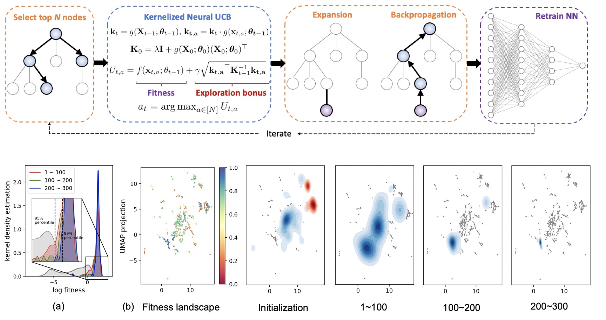

## About Me

I am a final-year undergraduate student at [Tsinghua University](https://www.tsinghua.edu.cn/en/index.htm). I'm fortunate to collaborate with [Prof. Mengdi Wang](https://mwang.princeton.edu/) at Princeton University as a research intern. In Spring 2021, I was lucky to work with [Prof. Cyrus Shahabi](https://viterbi.usc.edu/directory/faculty/Shahabi/Cyrus). In Fall 2020, I was a research assistant in Tsinghua Universal Machine Learning (THUML) Group under the supervision of [Prof. Mingsheng Long](http://ise.thss.tsinghua.edu.cn/~mlong/).

## Publications & Preprints

<table frame=void rules=none>
    <tr>
        <td width="220px">
            <!--左侧内容-->
             
            
        </td>
        <td>
            <!--右侧内容-->
             
            <b> Tree-Based Neural Bandits for High-Value Protein Design </b>
             
            <b>Chenyu Wang</b>*, Joseph Kim*,  <a href="https://profiles.stanford.edu/186687">Le Cong</a>, <a href="https://mwang.princeton.edu/">Mengdi Wang</a> (* Equal Contribution)
             
            Under review of International Conference on Artificial Intelligence and Statistics. <b>AISTATS 2022</b>.
        </td>
    </tr>
</table>

We propose an MCTS-guided neural contextual bandits algorithm that utilizes a modified upper-confidence bound algorithm for accelerating the search for optimal protein designs. This approach finds a diverse and rich class of high fitness proteins using substantially fewer design queries.

<table style="margin-left: auto; margin-right: auto;" frame=void rules=none>
    <tr>
        <td width="220px">
            <!--左侧内容-->
             
            
        </td>
        <td>
            <!--右侧内容-->
             
            <b> HAGEN: Homophily-Aware Graph Convolutional Recurrent Network for Crime Forecasting </b>
             
            <b>Chenyu Wang</b>*, Zongyu Lin*, Xiaochen Yang, <a href="http://www-scf.usc.edu/~mingxuay/">Mingxuan Yue</a>, <a href="https://caozhangjie.github.io/">Jiao Sun</a>, <a href="https://viterbi.usc.edu/directory/faculty/Shahabi/Cyrus">Cyrus Shahabi</a> (* Equal Contribution)
             
            Arxiv preprint, under review of AAAI Conference on Artificial Intelligence. <b>AAAI 2022</b>.
             
            <a href="https://arxiv.org/pdf/2109.12846.pdf"> [PDF] </a>
        </td>
    </tr>
</table>

We present HAGEN, an end-to-end graph convolutional recurrent network with a novel homophily-aware graph learning module for crime forecasting. HAGEN uses an adaptive graph structure to capture the dependency of crime patterns between regions and incorporates direction-aware diffusion convolution layer with GRU module to learn spatiotemporal dynamics.

<table style="margin-left: auto; margin-right: auto;" frame=void rules=none>
    <tr>
        <td width="220px">
            <!--左侧内容-->
             
            
        </td>
        <td>
            <!--右侧内容-->
             
            <b> Open Domain Generalization with Domain-Augmented Meta-Learning </b>
             
            Yang Shu*, <a href="https://caozhangjie.github.io/">Zhangjie Cao</a>*, <b>Chenyu Wang</b>*, <a href="https://www.thss.tsinghua.edu.cn/publish/soften/3131/2010/20101219100058471372347/20101219100058471372347_.html">Jianmin Wang</a>, <a href="http://ise.thss.tsinghua.edu.cn/~mlong/">Mingsheng Long</a> (* Equal Contribution)
             
            IEEE Conference on Computer Vision and Pattern Recognition. <b>CVPR 2021</b>.
             
            <a href="https://arxiv.org/pdf/2104.03620.pdf"> [PDF] </a> <a href="https://github.com/thuml/OpenDG-DAML"> [Code] </a>
        </td>
    </tr>
</table>

We propose a novel Domain-Augmented Meta-Learning framework (DAML) to address the new open domain generalization problem, which conducts meta-learning over domains augmented at feature-level by specially designed Dir-mixup and at label-level by distilled soft-labels.

## Selected Awards
- 
  
## Internship Experience
- 
