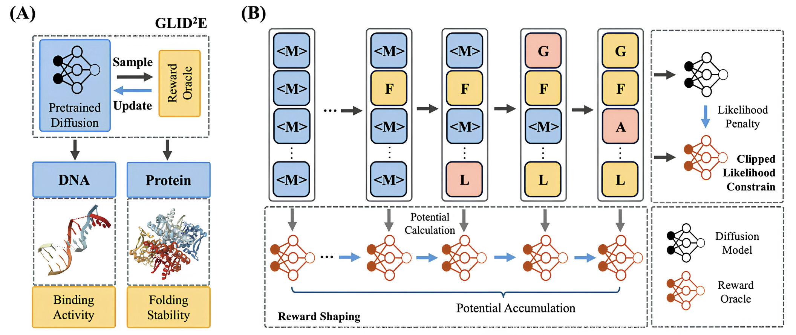

<h2>
About Me
</h2>

I am a fourth-year PhD student at [MIT CSAIL](https://www.csail.mit.edu/), advised by [Tommi Jaakkola](https://people.csail.mit.edu/tommi/). 
My research interests lie broadly in deep generative models, reinforcement learning, multi-modal learning, and AI for science. During my PhD, I was an research intern at [Meta FAIR](https://ai.meta.com/) and [Genentech](https://www.gene.com/). My research has been supported by the [Citadel GQS PhD Fellowship](https://www.citadel.com/careers/programs-and-events/gqs-phd-fellowship/).

Before my PhD, I obtained my Bachelor's degree from [Tsinghua University](https://www.tsinghua.edu.cn/en/index.htm), working as a research assistant in Tsinghua Universal Machine Learning (THUML) Group under the supervision of [Mingsheng Long](http://ise.thss.tsinghua.edu.cn/~mlong/). I was also fortunate to work as a research intern with [Mengdi Wang](https://mwang.princeton.edu/) at Princeton University and with [Cyrus Shahabi](https://viterbi.usc.edu/directory/faculty/Shahabi/Cyrus) at University of Southern California.

<!-- Feel free to contact me at wangchy [at] mit [dot] edu. -->

[Google Scholar](https://scholar.google.com/citations?user=Kq0dhLAAAAAJ&hl) / [LinkedIn](https://www.linkedin.com/in/chenyu-wang-3a6a9a193/) / [Twitter](https://twitter.com/ChenyuW64562111)

[Resume](resume_ChenyuWang_Aug2025.pdf) (Updated in Aug 2025)
<!-- [Resume](resume_ChenyuWang.pdf) (Updated in Nov 2023) -->
 

<h2>
Research
</h2>
My research focuses on developing controllable and efficient generative models, via reinforcement learning, multi-modal learning, and representation learning. I work across various application domains, including language models, vision, and scientific data (e.g. biochemistry). My recent work explores:

<ul>
<li><b>Reinforcement learning, reasoning, and inference-time alignment</b> for deep generative models and language models. [8, 10, 13, 14] </li>
<li><b>Multi-modal learning</b>, especially multi-modal representations and their interactions with generative models. [4, 6, 7, 9, 15, 16]</li>
<li><b>Enhancing biochemistry discovery</b> through generative models and agents. [3, 5, 11, 12] </li>
</ul>
 

<h2>
Publications & Preprints
</h2>
Full publication list can be found on <a href="https://scholar.google.com/citations?user=Kq0dhLAAAAAJ&hl)"> Google Scholar</a>.
 
(* Equal Contribution)

    

        <button class="tab-button active" onclick="showTab('selected')">Selected Publications</button>
        <button class="tab-button" onclick="showTab('all')">All Publications</button>
    

    
    

        <!-- Selected Publications: Most recent and impactful ones -->
        <table frame=void rules=none>
            <tr>
                <td width="33%">
                     
                    
                </td>
                <td>
                     
                    <b> 16. Learning Diffusion Models with Flexible Representation Guidance </b>
                     
                    <b>Chenyu Wang</b>*, Cai Zhou*, Sharut Gupta, Zongyu Lin, Stefanie Jegelka, Stephen Bates, Tommi Jaakkola
                     
                    Advances in Neural Information Processing Systems. <b>NeurIPS 2025</b>.
                     
                    Also Oral at ICML 2025 FM4LS workshop.
                     
                    <a href="https://arxiv.org/pdf/2507.08980"> [Paper] </a> <a href="https://github.com/ChenyuWang-Monica/REED"> [Code] </a>
                </td>
            </tr>
        </table>

          

        <table frame=void rules=none>
            <tr>
                <td width="33%">
                     
                    
                </td>
                <td>
                     
                    <b> 15. Next Semantic Scale Prediction via Hierarchical Diffusion Language Models</b>
                     
                    Cai Zhou*, <b>Chenyu Wang</b>*, Dinghuai Zhang*, Shangyuan Tong, Yifei Wang, Stephen Bates, Tommi Jaakkola
                     
                    Advances in Neural Information Processing Systems. <b>NeurIPS 2025</b>.
                     
                </td>
            </tr>
        </table>

          

        <table frame=void rules=none>
            <tr>
                <td width="33%">
                     
                    
                </td>
                <td>
                     
                    <b>8. Fine-Tuning Discrete Diffusion Models via Reward Optimization with Applications to DNA and Protein Design </b>
                     
                    <b>Chenyu Wang</b>*, Masatoshi Uehara*, Yichun He, Amy Wang, Tommaso Biancalani, Avantika Lal, Tommi Jaakkola, Sergey Levine, Hanchen Wang, Aviv Regev
                     
                    International Conference on Learning Representations. <b>ICLR 2025</b>.
                     
                    <a href="https://arxiv.org/abs/2410.13643"> [Paper] </a><a href="https://github.com/ChenyuWang-Monica/DRAKES"> [Code] </a>
                </td>
            </tr>
        </table>

          

        <table frame=void rules=none>
            <tr>
                <td width="33%">
                     
                    
                </td>
                <td>
                     
                    <b>7. An Information Criterion for Controlled Disentanglement of Multimodal Data </b>
                     
                    <b>Chenyu Wang</b>*, Sharut Gupta*, Xinyi Zhang, Sana Tonekaboni, Stefanie Jegelka, Tommi Jaakkola, Caroline Uhler
                     
                    International Conference on Learning Representations. <b>ICLR 2025</b>.
                     
                    Also Oral and <b>Honorable Mention Award</b> at NeurIPS 2024 UniReps workshop.
                     
                    <a href="http://arxiv.org/abs/2410.23996"> [Paper] </a><a href="https://github.com/uhlerlab/DisentangledSSL"> [Code] </a>
                </td>
            </tr>
        </table>

          

        <table frame=void rules=none>
            <tr>
                <td width="33%">
                     
                    
                </td>
                <td>
                     
                    <b>6. In-Context Symmetries: Self-Supervised Learning through Contextual World Models </b>
                     
                    Sharut Gupta*, <b>Chenyu Wang</b>*, Yifei Wang*, Tommi Jaakkola, Stefanie Jegelka, 
                     
                    Advances in Neural Information Processing Systems. <b>NeurIPS 2024</b>.
                     
                    Also Oral at NeurIPS 2024 SSL workshop.
                     
                    <a href="https://arxiv.org/abs/2405.18193"> [Paper] </a><a href="https://github.com/Sharut/In-Context-Symmetries"> [Code] </a> <a href="https://www.csail.mit.edu/news/machines-self-adapt-new-tasks-without-re-training"> [MIT CSAIL News]</a>
                </td>
            </tr>
        </table>

          

        <table frame=void rules=none>
            <tr>
                <td width="33%">
                     
                    
                </td>
                <td>
                     
                    <b>4. Removing Biases from Molecular Representations via Information Maximization </b>
                     
                    <b>Chenyu Wang</b>, Sharut Gupta, Caroline Uhler, Tommi Jaakkola
                     
                    International Conference on Learning Representations. <b>ICLR 2024</b>.
                     
                    <a href="https://arxiv.org/abs/2312.00718"> [Paper] </a> <a href="https://github.com/uhlerlab/InfoCORE"> [Code] </a>
                </td>
            </tr>
        </table>
    

    
    

<table frame=void rules=none>
    <tr>
        <td width="33%">
            <!--左侧内容-->
             
            
        </td>
        <td>
            <!--右侧内容-->
             
            <b> 16. Learning Diffusion Models with Flexible Representation Guidance </b>
             
            <b>Chenyu Wang</b>*, Cai Zhou*, Sharut Gupta, Zongyu Lin, Stefanie Jegelka, Stephen Bates, Tommi Jaakkola
             
            Advances in Neural Information Processing Systems. <b>NeurIPS 2025</b>.
             
            Also Oral at ICML 2025 FM4LS workshop.
             
            <a href="https://arxiv.org/pdf/2507.08980"> [Paper] </a> <a href="https://github.com/ChenyuWang-Monica/REED"> [Code] </a>
        </td>
    </tr>
</table>

 
 

<table frame=void rules=none>
    <tr>
        <td width="33%">
            <!--左侧内容-->
             
            
        </td>
        <td>
            <!--右侧内容-->
             
            <b> 15. Next Semantic Scale Prediction via Hierarchical Diffusion Language Models</b>
             
            Cai Zhou*, <b>Chenyu Wang</b>*, Dinghuai Zhang*, Shangyuan Tong, Yifei Wang, Stephen Bates, Tommi Jaakkola
             
            Advances in Neural Information Processing Systems. <b>NeurIPS 2025</b>.
             
            <!-- <a href=""> [Paper] </a> <a href=""> [Code] </a> -->
        </td>
    </tr>
</table>

 
 

<table frame=void rules=none>
    <tr>
        <td width="33%">
            <!--左侧内容-->
             
            
        </td>
        <td>
            <!--右侧内容-->
             
            <b>14. GLID$^2$E: A Gradient-Free Lightweight Fine-tune Approach for Discrete Sequence Design </b>
             
            Hanqun Cao*, Haosen Shi*, <b>Chenyu Wang</b>, Sinno Jialin Pan, Pheng-Ann Heng
             
            Advances in Neural Information Processing Systems. <b>NeurIPS 2025</b>.
             
            <a href="https://openreview.net/pdf?id=29YgYt69Kl"> [Paper] </a>
        </td>
    </tr>
</table>

 
 

<table frame=void rules=none>
    <tr>
        <td width="33%">
            <!--左侧内容-->
             
            
        </td>
        <td>
            <!--右侧内容-->
             
            <b>13. Derivative-Free Guidance in Continuous and Discrete Diffusion Models with Soft Value-Based Decoding </b>
             
            Xiner Li, Yulai Zhao, <b>Chenyu Wang</b>, Gabriele Scalia, Gokcen Eraslan, Surag Nair, Tommaso Biancalani, Aviv Regev, Sergey Levine, Masatoshi Uehara
             
            Advances in Neural Information Processing Systems. <b>NeurIPS 2025</b>.
             
            <a href="https://arxiv.org/abs/2408.08252"> [Paper] </a> <a href="https://github.com/masa-ue/SVDD"> [Code] </a>
            <!-- <a href="protein_design.pdf"> [Paper] </a> -->
        </td>
    </tr>
</table>

 
 

<table frame=void rules=none>
    <tr>
        <td width="33%">
            <!--左侧内容-->
             
            
        </td>
        <td>
            <!--右侧内容-->
             
            <b>12. SpatialAgent: An Autonomous AI Agent for Spatial Biology </b>
             
            Hanchen Wang*#, Yichun He*, Paula P Coelho*, Matthew Bucci*, ..., <b>Chenyu Wang</b>, ..., Aviv Regev#
             
            Preprint.
             
            <a href="https://www.biorxiv.org/content/10.1101/2025.04.03.646459v1.full"> [Paper] </a> <a href="https://github.com/Genentech/SpatialAgent"> [Code] </a>
        </td>
    </tr>
</table>

 
 

<table frame=void rules=none>
    <tr>
        <td width="33%">
            <!--左侧内容-->
             
            
        </td>
        <td>
            <!--右侧内容-->
             
            <b>11. CellFlux: Simulating Cellular Morphology Changes via Flow Matching </b>
             
            Yuhui Zhang*, Yuchang Su*, <b>Chenyu Wang</b>, Tianhong Li, Zoe Wefers, Jeffrey Nirschl, James Burgess, Daisy Ding, Alejandro Lozano, Emma Lundberg, Serena Yeung-Levy
             
            International Conference on Machine Learning. <b>ICML 2025</b>.
             
            <a href="https://arxiv.org/pdf/2502.09775"> [Paper] </a> <a href="https://yuhui-zh15.github.io/CellFlux/"> [Project Webpage] </a>
        </td>
    </tr>
</table>

 
 

<table frame=void rules=none>
    <tr>
        <td width="33%">
            <!--左侧内容-->
             
            
        </td>
        <td>
            <!--右侧内容-->
             
            <b>10. Inference-time Alignment in Diffusion Models with Reward-Guided Generation: Tutorial and Review </b>
             
            Masatoshi Uehara, Yulai Zhao, <b>Chenyu Wang</b>, Xiner Li, Aviv Regev, Sergey Levine, Tommaso Biancalani
             
            Preprint.
             
            <a href="https://arxiv.org/pdf/2501.09685"> [Paper] </a> <a href="https://github.com/masa-ue/AlignInversePro"> [Code] </a>
        </td>
    </tr>
</table>

 
 

<table frame=void rules=none>
    <tr>
        <td width="33%">
            <!--左侧内容-->
             
            
        </td>
        <td>
            <!--右侧内容-->
             
            <b>9. Automated Generation of Challenging Multiple-Choice Questions for Vision Language Model Evaluation </b>
             
            Yuhui Zhang*, Yuchang Su*, Yiming Liu, Xiaohan Wang, James Burgess, Elaine Sui, <b>Chenyu Wang</b>, Josiah Aklilu, Alejandro Lozano, Anjiang Wei, Ludwig Schmidt, Serena Yeung-Levy
             
            IEEE Conference on Computer Vision and Pattern Recognition. <b>CVPR 2025</b>.
             
            <a href="https://openaccess.thecvf.com/content/CVPR2025/papers/Zhang_Automated_Generation_of_Challenging_Multiple-Choice_Questions_for_Vision_Language_Model_CVPR_2025_paper.pdf"> [Paper] </a> <a href="https://yuhui-zh15.github.io/AutoConverter-Website/"> [Project Webpage] </a> <a href="https://github.com/yuhui-zh15/AutoConverter"> [Code] </a>
            <!-- <a href="protein_design.pdf"> [Paper] </a> -->
        </td>
    </tr>
</table>

 
 

<table frame=void rules=none>
    <tr>
        <td width="33%">
            <!--左侧内容-->
             
            
        </td>
        <td>
            <!--右侧内容-->
             
            <b>8. Fine-Tuning Discrete Diffusion Models via Reward Optimization with Applications to DNA and Protein Design </b>
             
            <b>Chenyu Wang</b>*, Masatoshi Uehara*, Yichun He, Amy Wang, Tommaso Biancalani, Avantika Lal, Tommi Jaakkola, Sergey Levine, Hanchen Wang, Aviv Regev
             
            International Conference on Learning Representations. <b>ICLR 2025</b>.
             
            <a href="https://arxiv.org/abs/2410.13643"> [Paper] </a><a href="https://github.com/ChenyuWang-Monica/DRAKES"> [Code] </a>
            <!-- <a href="protein_design.pdf"> [Paper] </a> -->
        </td>
    </tr>
</table>

 
 

<table frame=void rules=none>
    <tr>
        <td width="33%">
            <!--左侧内容-->
             
            
        </td>
        <td>
            <!--右侧内容-->
             
            <b>7. An Information Criterion for Controlled Disentanglement of Multimodal Data </b>
             
            <b>Chenyu Wang</b>*, Sharut Gupta*, Xinyi Zhang, Sana Tonekaboni, Stefanie Jegelka, Tommi Jaakkola, Caroline Uhler
             
            International Conference on Learning Representations. <b>ICLR 2025</b>.
             
            Also Oral and <b>Honorable Mention Award</b> at NeurIPS 2024 UniReps workshop.
            <!-- NeurIPS 2024 Workshop on Unifying Representations in Neural Models. <b>(Honorable Mention Award)</b> -->
            <!--  
            NeurIPS: New Frontiers of AI for Drug Discovery and Development. <b>NeurIPS 2023 AI4D3 Workshop</b>. -->
             
            <a href="http://arxiv.org/abs/2410.23996"> [Paper] </a><a href="https://github.com/uhlerlab/DisentangledSSL"> [Code] </a>
            <!-- <a href="https://arxiv.org/abs/2312.00718"> [Paper] </a> <a href="https://github.com/uhlerlab/InfoCORE"> [Code] </a> -->
        </td>
    </tr>
</table>

 
 

<table frame=void rules=none>
    <tr>
        <td width="33%">
            <!--左侧内容-->
             
            
        </td>
        <td>
            <!--右侧内容-->
             
            <b>6. In-Context Symmetries: Self-Supervised Learning through Contextual World Models </b>
             
            Sharut Gupta*, <b>Chenyu Wang</b>*, Yifei Wang*, Tommi Jaakkola, Stefanie Jegelka, 
             
            Advances in Neural Information Processing Systems. <b>NeurIPS 2024</b>.
             
            Also Oral at NeurIPS 2024 SSL workshop.
            <!--  
            NeurIPS: New Frontiers of AI for Drug Discovery and Development. <b>NeurIPS 2023 AI4D3 Workshop</b>. -->
             
            <a href="https://arxiv.org/abs/2405.18193"> [Paper] </a><a href="https://github.com/Sharut/In-Context-Symmetries"> [Code] </a> <a href="https://www.csail.mit.edu/news/machines-self-adapt-new-tasks-without-re-training"> [MIT CSAIL News]</a>
            <!-- <a href="https://arxiv.org/abs/2312.00718"> [Paper] </a> <a href="https://github.com/uhlerlab/InfoCORE"> [Code] </a> -->
        </td>
    </tr>
</table>

 
 

<table frame=void rules=none>
    <tr>
        <td width="33%">
            <!--左侧内容-->
             
            
        </td>
        <td>
            <!--右侧内容-->
             
            <b>5. Dirichlet Flow Matching with Applications to DNA Sequence Design </b>
             
            Hannes Stark*, Bowen Jing*, Chenyu Wang, Gabriele Corso, Bonnie Berger, Regina Barzilay, Tommi Jaakkola, 
             
            International Conference on Machine Learning. <b>ICML 2024</b>.
             
            Also Oral at ICLR 2024 MLGenX workshop.
             
            <a href="https://arxiv.org/abs/2402.05841"> [Paper] </a> <a href="https://github.com/HannesStark/dirichlet-flow-matching"> [Code] </a>
        </td>
    </tr>
</table>

 
 

<table frame=void rules=none>
    <tr>
        <td width="33%">
            <!--左侧内容-->
             
            
        </td>
        <td>
            <!--右侧内容-->
             
            <b>4. Removing Biases from Molecular Representations via Information Maximization </b>
             
            <b>Chenyu Wang</b>, Sharut Gupta, Caroline Uhler, Tommi Jaakkola
             
            International Conference on Learning Representations. <b>ICLR 2024</b>.
            <!--  
            NeurIPS: New Frontiers of AI for Drug Discovery and Development. <b>NeurIPS 2023 AI4D3 Workshop</b>. -->
             
            <a href="https://arxiv.org/abs/2312.00718"> [Paper] </a> <a href="https://github.com/uhlerlab/InfoCORE"> [Code] </a>
        </td>
    </tr>
</table>

<!-- We propose InfoCORE to mitigate the confounding factors in multimodal molecular representation learning from multiple information sources, in particular the confounding batch effects in drug screening data. -->
 
 

<table frame=void rules=none>
    <tr>
        <td width="33%">
        <!--左侧内容-->
         
        
        </td>
        <td>
        <!--右侧内容-->
         
        <b>3. Tree-Based Neural Bandits for High-Value Protein Design </b>
         
        <b>Chenyu Wang</b>*, Joseph Kim*, Le Cong, Mengdi Wang
         
        56th Annual Conference on Information Sciences and Systems. <b>CISS 2022</b>.
         
        <a href="protein_design.pdf"> [Paper] </a>
        </td>
    </tr>
</table>

<!-- We propose an MCTS-guided neural contextual bandits algorithm that utilizes a modified upper-confidence bound algorithm for accelerating the search for optimal protein designs. -->
 
 

<table frame=void rules=none>
<!-- <table style="margin-left: auto; margin-right: auto;" frame=void rules=none> -->
    <tr>
        <td width="33%">
        <!--左侧内容-->
         
        
        </td>
        <td>
        <!--右侧内容-->
         
        <b>2. HAGEN: Homophily-Aware Graph Convolutional Recurrent Network for Crime Forecasting </b>
         
        <b>Chenyu Wang</b>*, Zongyu Lin*, Xiaochen Yang, Mingxuan Yue, Jiao Sun, Cyrus Shahabi
         
        AAAI Conference on Artificial Intelligence. <b>AAAI 2022</b>. <b>(Oral Presentation)</b>
         
        <a href="https://ojs.aaai.org/index.php/AAAI/article/view/20338"> [Paper] </a> <a href="https://github.com/Rafa-zy/HAGEN"> [Code] </a> <a href="https://www.youtube.com/watch?v=IyBV33tEx0E"> [Talk at TGL] </a>
        </td>
    </tr>
</table>

<!-- We present HAGEN, an end-to-end graph convolutional recurrent network with a novel homophily-aware graph learning module to learn spatiotemporal dynamics for crime forecasting. -->
 
 

<!-- <table style="margin-left: auto; margin-right: auto;" frame=void rules=none> -->
<table frame=void rules=none>
    <tr>
        <td width="33%">
         
        
        </td>
        <td>
         
        <b> 1. Open Domain Generalization with Domain-Augmented Meta-Learning </b>
         
        Yang Shu*, Zhangjie Cao*, <b>Chenyu Wang</b>, Jianmin Wang, Mingsheng Long
         
        IEEE Conference on Computer Vision and Pattern Recognition. <b>CVPR 2021</b>.
         
        <a href="https://openaccess.thecvf.com/content/CVPR2021/papers/Shu_Open_Domain_Generalization_with_Domain-Augmented_Meta-Learning_CVPR_2021_paper.pdf"> [Paper] </a> <a href="https://github.com/thuml/OpenDG-DAML"> [Code] </a>
        </td>
    </tr>
</table>
<!-- We propose a novel Domain-Augmented Meta-Learning framework (DAML) to address the new open domain generalization problem, which conducts meta-learning over domains augmented at both feature-level and label-level. -->
 
 
    

<h2>
Education and Research Experience
</h2>
<table frame=void rules=none>
    <tr>
        <td width="15%">
             
            
        </td>
        <td>
             
            <b> Massachusetts Institute of Technology</b>
             
            2022.08-Present
             
            PhD student in Computer Science
             
            Advisor: <a href="https://people.csail.mit.edu/tommi/">Tommi Jaakkola</a>            
        </td>
    </tr>
</table>

<table frame=void rules=none>
    <tr>
        <td width="15%">
             
            
        </td>
        <td>
             
            <b> Meta FAIR</b>
             
            2024.05-2024.08
             
            Research intern
             
            Advisor: <a href="https://yuandong-tian.com/">Yuandong Tian</a>, <a href="https://cranial-xix.github.io">Bo Liu</a>              
        </td>
    </tr>
</table>

<table frame=void rules=none>
    <tr>
        <td width="15%">
             
            
        </td>
        <td>
             
            <b> Genentech</b>
             
            2024.05-2024.08
             
            Research intern
             
            Advisor: <a href="https://www.gene.com/scientists/our-scientists/aviv-regev">Aviv Regev</a>
             
            Mentor: <a href="https://www.hanchenw.com/">Hanchen Wang</a>, <a href="https://www.masatoshiuehara.com/">Masatoshi Uehara</a>       
        </td>
    </tr>
</table>

<table frame=void rules=none>
    <tr>
        <td width="15%">
             
            
        </td>
        <td>
             
            <b> Tsinghua University</b>
             
            2018.08-2022.06
             
            B.S. in Economics
             
            Minor in Data Science and Technology
             
            Advisor: <a href="http://ise.thss.tsinghua.edu.cn/~mlong/">Mingsheng Long</a>  
             
            Mentor: <a href="https://shuyang96.github.io/">Yang Shu</a>       
        </td>
    </tr>
</table>

<table frame=void rules=none>
    <tr>
        <td width="15%">
             
            
        </td>
        <td>
             
            <b> Princeton University</b>
             
            2021.06-2021.12
             
            Research intern
             
            Advisor: <a href="https://mwang.princeton.edu/">Mengdi Wang</a>, <a href="https://profiles.stanford.edu/186687">Le Cong</a>  
             
            Mentor: Joseph Kim, <a href="https://huazhengwang.github.io/">Huazheng Wang</a>       
        </td>
    </tr>
</table>

<table frame=void rules=none>
    <tr>
        <td width="15%">
             
            
        </td>
        <td>
             
            <b> University of Southern California</b>
             
            2021.01-2021.06
             
            Research intern
             
            Advisor: <a href="https://viterbi.usc.edu/directory/faculty/Shahabi/Cyrus">Cyrus Shahabi</a>  
             
            Mentor: <a href="https://caozhangjie.github.io/">Jiao Sun</a>, <a href="http://www-scf.usc.edu/~mingxuay/">Mingxuan Yue</a>       
        </td>
    </tr>
</table>
<!-- A8A8A8 -->
<h2>
Selected Awards
</h2>
- <i>2025</i> &nbsp;&nbsp; <b>Citadel GQS PhD Fellowship</b> (the only recipient in EECS)
- <i>2025</i> &nbsp;&nbsp; <b>D. E. Shaw Research Doctoral Fellowship</b>
- <i>2024</i> &nbsp;&nbsp; <b>Honorable Mention Award, NeurIPS 2024 UniReps Workshop</b>
- <i>2022</i> &nbsp;&nbsp; <b>MIT EECS Great Educators Fellowship</b>
- <i>2022</i> &nbsp;&nbsp; <b>Outstanding Undergraduate in Tsinghua</b> (2% in Tsinghua)
- <i>2022</i> &nbsp;&nbsp; Outstanding Undergraduate in Beijing
- <i>2022</i> &nbsp;&nbsp; <b>Chen Daisun Scholarship</b> (3 in Tsinghua SEM)
- <i>2022</i> &nbsp;&nbsp; Undergraduate Commencement Student Speaker of Tsinghua SEM
- <i>2021</i> &nbsp;&nbsp; Meritorious Winner in MCM/ICM Mathematical Contest in Modelling
- <i>2020</i> &nbsp;&nbsp; Tang Lixin Scholarship (50 in Tsinghua)
- <i>2019</i> &nbsp;&nbsp; <b>National Scholarship</b> (0.2% in China)
- <i>2019</i> &nbsp;&nbsp; Athletics Excellence Scholarship of Tsinghua
- <i>2018</i> &nbsp;&nbsp; Gold medalist of 50th <b>International Chemistry Olympiad</b> (4 in China, 6th place in the world)
- <i>2016</i> &nbsp;&nbsp; Silver medalist of 15th China Girl's Mathematical Olympiad (50 in China)
 
 

<h2>
Internship Experience
</h2>
- **Meta FAIR**, *Research Intern*, May 2025 - Aug. 2025
- **Genentech**, *Research Intern at Regev Lab*, May 2024 - Aug. 2024
- **Jane Street**, *Quantitative Trading Intern* (return offer extended), Jun. 2021 - Sept. 2021
- **WizardQuant Capital Management**, *Quantitative Research Intern*, Jun. 2020 - Aug. 2020
- **Techsharpe Quant Capital Management**, *Data Analyst Intern*, Jan. 2020 - Feb. 2020
 
 

<h2>
Services
</h2>
Reviewer: ICLR 2025/2026, NeurIPS 2024/2025, ICML 2025, PLOS Computational Biology
 
 

<h2>
Miscellaneous
</h2>
I enjoy (and perhaps good at) doing sports. During undergrad, I was an active member in the track team and soccer team in my school, getting 1st place in 4\*400m relay, 3rd place in 1500m, women's soccer champion etc. I'm also a fan of literature and classical music. I enjoy travelling and tasting local delicacies. 
 

